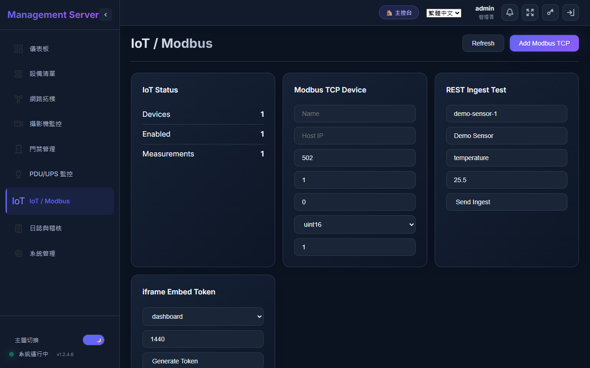
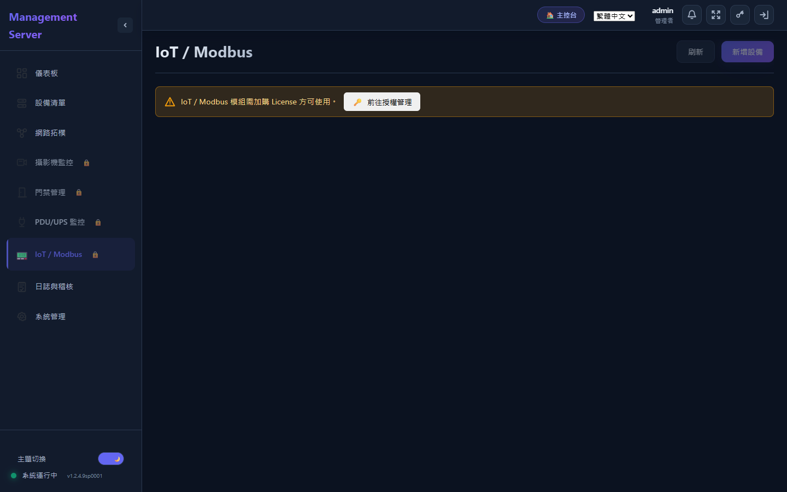
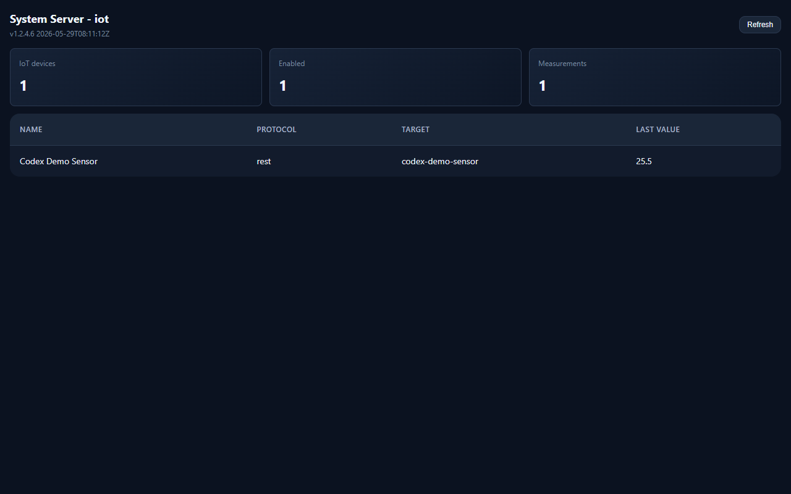

# IoT / Modbus 圖文操作手冊

適用版本：NMS v1.2.4.x  
適用對象：現場工程師、系統管理員、維運人員

本手冊用「實際操作」的方式說明 IoT / Modbus 模組。操作時請先準備感測器或閘道的通訊資料，例如 IP、Port、Slave ID、暫存器位址、資料型別、倍率與單位。

> 實機截圖來源預計使用 `http://10.100.100.11:8080`。目前該站點可連線，但瀏覽器擷取時頁面未完成繪製，因此本版先使用專案既有 IoT 畫面圖，後續可直接替換圖片。

## 1. 進入 IoT / Modbus 模組

登入 NMS 後，從左側選單點選 **IoT / Modbus**。

如果畫面出現「IoT / Modbus 模組需加購 License 方可使用」，代表目前授權尚未啟用。請先到 **系統管理 / 授權管理** 匯入包含 `iot` 功能的 License。

操作重點：

- 只有 Admin / Editor 角色可進入 IoT 模組。
- 未授權時，只會看到授權提示，無法新增設備或讀取資料。
- 授權啟用後，頁面會顯示狀態卡、感測器讀值、設備清單、最近量測、設定與嵌入 Token。

## 2. 主畫面看什麼

進入頁面後，先看上方狀態與讀值區。這裡像現場儀表板，目的是快速判斷「有幾台設備、是否有資料、是否有轉發佇列卡住」。

### IoT Status

| 項目 | 說明 | 現場判斷方式 |
| --- | --- | --- |
| Devices | 已建立的 IoT 設備總數 | 數量為 0 表示還沒有建立感測器或閘道點位 |
| Enabled | 已啟用且會被輪詢的設備數 | 若設備存在但 Enabled 為 0，通常是設備被停用 |
| Measurements | NMS 已收到或輪詢到的量測筆數 | 新增設備後可用它確認是否真的有資料進來 |
| Pending | 等待 HTTP Forward 轉發的資料 | 長時間增加代表外部 webhook 可能連不上 |
| Failed | 轉發失敗的資料 | 需要檢查 Forward URL、Token 或對方系統狀態 |
| Sent Hold | 已轉發成功、暫時保留的資料 | 預設保留約 10 分鐘後清理 |

### Sensor Readings

感測器卡片會顯示設備名稱、通訊協定、Unit ID、最新讀值與狀態。

| 狀態 | 含義 | 建議處理 |
| --- | --- | --- |
| Online | 最近一次輪詢成功 | 正常 |
| Offline | 尚未有成功讀值 | 先按 Poll，若仍無資料再檢查連線 |
| Error | 最近一次輪詢失敗 | 查看設備清單中的錯誤訊息、IP、Port、Slave ID、暫存器設定 |

## 3. 新增 Modbus 設備

在右上角點選 **新增設備**，系統會開啟新增設備視窗。先選通訊方式，再填通訊與暫存器欄位。

支援的新增分頁：

- **Modbus TCP**：設備本身有 Ethernet，直接用 IP + Port 輪詢。
- **Modbus RTU**：NMS 主機透過 COM Port 或 USB-RS485 轉接器讀取。
- **Modbus RS485**：半雙工 RS485 現場匯流排，通訊格式與 RTU 相同。
- **RTU over TCP**：RS485-to-Ethernet 透明轉換器，不是標準 Modbus TCP gateway 時使用。

### 新增設備欄位完整說明

| 欄位 | 功能 | 常見填法 | 注意事項 |
| --- | --- | --- | --- |
| Device name | 設備在 NMS 上顯示的名稱 | `1F Temp-Humi-01`、`UPS Room CO2` | 建議包含位置與感測器用途，方便日後維修 |
| Sensor type | 感測器類型 | Temperature、Humidity、Temperature + Humidity、Power、Voltage、Current、Pressure、CO2、PM2.5 | 選溫濕度類型時，系統會自動套用較常見的 FC04、int16、倍率 0.1 |
| Metric name | 量測指標名稱 | `temperature`、`humidity`、`voltage`、`power` | 會出現在最近量測與轉發 payload 中；請使用英文小寫較利於串接 |
| Host / IP | Modbus TCP 或 RTU over TCP 目標 IP | `192.168.1.100` | 只在 TCP 類型顯示；需確認 NMS 主機可連到該 IP |
| Port | TCP 連線 Port | `502` | Modbus TCP 常用 502；透明轉換器可能是 4001、502、8899 |
| Serial port | RTU / RS485 使用的序列埠 | Windows：`COM3`；Linux：`/dev/ttyUSB0` | 只在 RTU / RS485 顯示；Windows 同一時間通常只能由一個程式開啟 |
| Baud rate | 串列通訊速度 | `9600`、`19200`、`38400` | 必須與感測器 DIP switch 或說明書一致 |
| Data bits | 每筆資料位元數 | 通常 `8` | 多數 Modbus RTU 是 8 |
| Parity | 同位檢查 | None (N)、Even (E)、Odd (O) | 需與設備一致；不一致會造成 timeout 或 CRC 錯誤 |
| Stop bits | 停止位元 | 通常 `1` | 少數設備使用 2 |
| Unit ID (Slave) | Modbus Slave ID | `1` 到 `247` | RS485 匯流排上每台設備必須不同 |
| Register address | 起始暫存器位址 | `0`、`1`、`100` | 注意說明書若寫 40001，系統通常填 offset `0`；若寫 30002，常填 `1` |
| Function code | 讀取功能碼 | FC01、FC02、FC03、FC04 | FC03 讀 Holding Register；FC04 讀 Input Register；FC01/FC02 讀布林點位 |
| Data type | 資料型別 | `uint16`、`int16`、`uint32`、`int32`、`float32` | 16-bit 讀 1 個 register，32-bit / float32 讀 2 個 registers |
| Scale | 倍率 | `1`、`0.1`、`0.01` | 實際值 = 原始值 x Scale + Offset |
| Offset | 偏移 | 通常 `0` | 用於校正，例如讀值固定差 2 度可填 `-2` |
| Poll interval (sec) | 輪詢間隔秒數 | `30`、`60`、`300` | 最小 5 秒；現場設備多時建議 60 秒以上 |
| Byte order | 同一個 16-bit register 內的位元組順序 | Big endian / Little endian | 讀值異常時才需要調整 |
| Word order | 32-bit 或 float32 的兩個 word 順序 | Big endian / Little endian | float32 數值亂跳時常需要調整 |

填完後按 **Add Device**。新增成功後，設備會出現在設備清單與感測器卡片中。

## 4. 現場操作範例：新增溫濕度感測器

假設感測器資料如下：

| 項目 | 值 |
| --- | --- |
| 通訊方式 | Modbus TCP |
| IP | `192.168.10.50` |
| Port | `502` |
| Slave ID | `1` |
| 溫度暫存器 | Address `0` |
| 濕度暫存器 | Address `1` |
| Function Code | FC04 |
| Data type | int16 / uint16 |
| Scale | `0.1` |

操作：

1. 點 **新增設備**。
2. 選 **Modbus TCP**。
3. Device name 填 `機房溫濕度-01`。
4. Sensor type 選 `Temperature + Humidity`。
5. Host / IP 填 `192.168.10.50`，Port 填 `502`。
6. Unit ID 填 `1`，Register address 填 `0`。
7. Function code 選 `FC04 Input Register`。
8. Scale 確認為 `0.1`，Poll interval 建議 `60`。
9. 按 **Add Device**。
10. 回到設備清單，按 **Poll** 立即讀一次。

成功時，感測器卡片會顯示溫度與濕度兩個值，例如 `25.3 C / 61.2 %`。

## 5. 設備清單操作

設備清單是維護點位的主要位置。

| 按鈕 / 欄位 | 說明 |
| --- | --- |
| Poll | 立即讀取該設備一次，不必等下一次輪詢 |
| Edit | 修改設備設定，例如 IP、暫存器、倍率、輪詢間隔 |
| Delete | 刪除設備設定；歷史量測仍依資料庫保留策略處理 |
| Last value | 最新一次成功解析後的值 |
| Last seen | 最近成功讀值時間 |
| Status | Online / Offline / Error |
| Last error | 最近一次錯誤，例如 timeout、CRC mismatch、unsupported data type |

現場建議：

- 新增設備後先按 **Poll**，確認能立即讀到值。
- 如果讀值是 `-`，先看 `Last error`。
- 如果數值差 10 倍，優先調整 **Scale**。
- 如果 float32 數值不合理，依序嘗試調整 **Byte order** 與 **Word order**。

## 6. 最近量測資料

最近量測表會顯示 NMS 收到的最新資料。

| 欄位 | 說明 |
| --- | --- |
| Time | 資料建立時間 |
| Source | 來源，可能是 device ID 或 external ID |
| Metric | 指標名稱 |
| Value | 量測值 |
| Forward status | 轉發狀態，包含 pending、sent、failed |

如果設備清單有讀值，但最近量測沒有增加，通常代表輪詢尚未成功寫入資料或設備還沒被 Poll。

## 7. REST Ingest Test

REST Ingest Test 用來模擬外部閘道推資料進 NMS，例如 MQTT bridge、OPC-UA gateway 或客製化程式。

| 欄位 | 功能 | 範例 |
| --- | --- | --- |
| External ID | 外部來源 ID | `demo-sensor-1` |
| Name | 來源顯示名稱 | `Demo Sensor` |
| Protocol | 來源協定標記 | `rest`、`mqtt`、`opcua`、`bacnet` |
| Metric | 指標名稱 | `temperature` |
| Value | 數值 | `25.5` |
| Send Ingest | 送出測試資料 | 成功後會出現在最近量測 |

這個功能不會主動去讀 Modbus，而是模擬「外部系統把資料推進來」。如果客戶已有 gateway，可先用這裡測 API 流程是否正常。

## 8. Protocol Capabilities

此區顯示目前 IoT 模組支援的接入方式。

| 協定 | 狀態 | 用途 |
| --- | --- | --- |
| Modbus TCP | Ready | NMS 直接透過 TCP 主動輪詢 |
| Modbus RTU | Ready | NMS 透過序列埠主動輪詢 |
| Modbus RS485 | Ready | NMS 透過 RS485 匯流排主動輪詢 |
| RTU over TCP | Ready | 透明串口伺服器，使用 RTU frame over TCP |
| REST / Webhook | Ready | 外部系統主動推資料到 NMS |
| HTTP Forward Queue | Ready | NMS 把收到的量測資料轉送到客戶系統 |
| MQTT Bridge | Bridge Ready | 需由 gateway 將 MQTT topic 轉成 REST ingest |
| OPC-UA Gateway | Bridge Ready | 需由 gateway 將 OPC-UA node 轉成 REST ingest |
| BACnet Gateway | Bridge Ready | 需由 gateway 將 BACnet/IP 點位轉成 REST ingest |

## 9. HTTP Forward Queue 設定

HTTP Forward Queue 會把 NMS 收到的 IoT 量測資料轉送到客戶系統。這適合客戶不想直接連每一台 Modbus 設備，而是讓 NMS 統一收集後再送出。

| 設定 | 功能 | 建議 |
| --- | --- | --- |
| Enabled | 是否啟用 HTTP 轉發 | 正式串接前先設為 Disabled，測通後再啟用 |
| URL | 客戶 webhook endpoint | 必須是對方可接收 POST 的完整 URL |
| Token | Bearer Token | 如對方 API 需要授權，填入 token；儲存後欄位會清空但系統保留設定 |
| Batch size | 每批最多送幾筆 | 預設 50；資料量大可調高，但不建議超過對方 API 負荷 |
| Flush Queue | 立即送出 pending 資料 | 測試 webhook 時可手動按一次 |
| Cleanup | 清理已送出保留資料 | sent 資料預設會短暫保留，通常不需手動清 |

轉發狀態：

- `pending`：資料已存入 NMS，等待送出。
- `sent`：已送出並收到對方 2xx 回應。
- `failed`：送出失敗，會記錄錯誤並等待後續處理。

## 10. iframe Embed Token

iframe Embed Token 可產生只讀嵌入碼，讓客戶入口網站把 NMS 的某個檢視嵌入 iframe。

| 欄位 | 說明 | 建議 |
| --- | --- | --- |
| Token name | Token 顯示名稱 | 例如 `Customer Portal - IoT` |
| View | 可嵌入的頁面 | 若只要 IoT 頁，選 `iot` |
| Expiry | 有效時間，單位分鐘 | 測試用可填 60；正式可依資安規範設定 |
| Generate Token | 產生 iframe HTML | 產生後請只提供給可信任系統 |
| Token list | 已建立 Token 清單 | 可查看有效、過期、最後使用時間 |
| Revoke | 撤銷 Token | 外洩或不再使用時立即撤銷 |

安全建議：

- Token URL 等同只讀入口，不要放在公開文件。
- Expiry 不要設太長。
- 若客戶入口網域固定，請搭配 iframe Allowlist。

## 11. iframe Allowlist

iframe Allowlist 控制哪些網站可以嵌入 NMS。

| 欄位 | 說明 | 範例 |
| --- | --- | --- |
| frame ancestors | 允許嵌入 NMS 的來源 | `'self'`、`https://portal.example.com` |
| Reload | 重新載入目前設定 | 修改前可先確認現值 |
| Save | 儲存允許清單 | 儲存後建議重新測試客戶入口 |

注意事項：

- 請使用 HTTPS 網域。
- 不建議使用萬用字元。
- 如果 iframe 顯示空白，先檢查瀏覽器 console 是否被 CSP / frame-ancestors 擋下。

## 12. 常見問題排查

| 現象 | 可能原因 | 處理方式 |
| --- | --- | --- |
| IoT 頁只看到 License 提示 | IoT 授權未啟用 | 到授權管理匯入包含 `iot` 的 License |
| 新增後一直 Offline | 還沒有成功輪詢 | 按 Poll，確認 IP、Port、Serial Port、Slave ID |
| Poll timeout | 網路不通或序列埠設定錯誤 | Ping 設備、確認 Port 502、防火牆、baud/parity/stop bits |
| CRC mismatch | RTU 封包或線路問題 | 檢查 A/B 線、終端電阻、baud、parity |
| 數值差 10 倍或 100 倍 | Scale 設錯 | 依設備手冊填 `0.1` 或 `0.01` |
| float32 數值很大或亂跳 | Byte / Word order 不符 | 嘗試切換 Byte order、Word order |
| 溫濕度只出現一個值 | Sensor type 或 address 設定不符 | 選 Temperature + Humidity，address 通常填第一個暫存器 |
| HTTP Forward pending 增加 | webhook 沒通或未啟用 | 檢查 Enabled、URL、Token、對方服務狀態 |
| iframe 無法顯示 | Token 過期或 allowlist 未放行 | 重新產生 Token，加入客戶入口網域 |

## 13. 現場交付檢查表

交付前請逐項確認：

- IoT License 已啟用。
- 每個設備名稱包含位置與用途。
- 每台 Modbus RTU / RS485 設備的 Unit ID 不重複。
- 新增後已按 Poll 並確認讀值正常。
- Scale、Offset、Byte order、Word order 已依實際讀值校正。
- 最近量測資料會持續增加。
- 若有串接客戶系統，HTTP Forward 顯示 sent。
- 若有 iframe 嵌入，Token 有效期與 allowlist 已設定。
- 已記錄每個感測器的 IP、Port、Slave ID、Register address、Function code、Data type。
